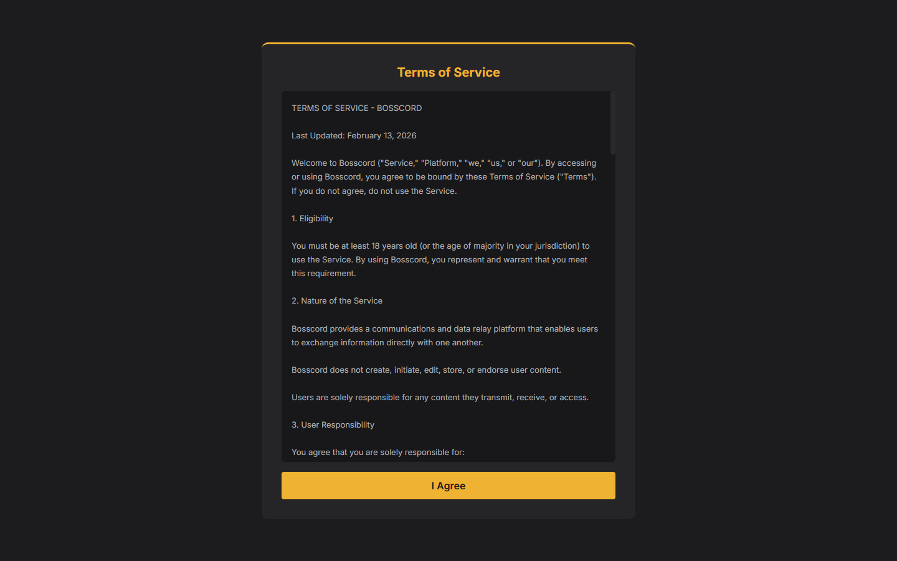
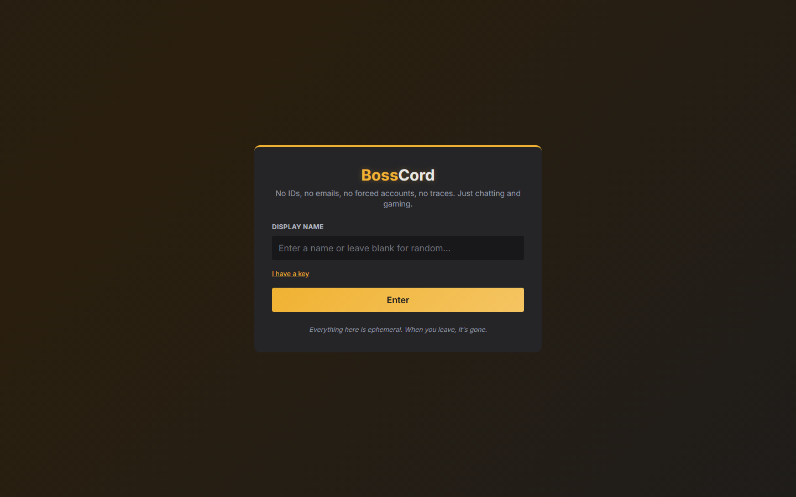

# BossCord

**An anonymous, ephemeral Discord-style chat platform with a built-in mini-game arcade and chip economy — Node.js/Socket.IO backend, buildless React frontend.**

> **⚠️ Important: BossCord is anonymous and ephemeral by design. Public
> instances can attract abuse. As the operator you are fully responsible for
> moderation and legal compliance. Strongly recommended for private use or
> well-moderated communities only — start LAN or invite-only with
> `MODERATOR_KEYS` configured. Use at your own risk.**
> See [Legal & responsible use](#legal--responsible-use) and
> [Moderation & anti-abuse](#moderation--anti-abuse).

## What it does

BossCord is real-time chat with public rooms and private servers (text/voice/video channels), designed around ephemerality: no accounts required to chat, and rooms/messages wipe daily at midnight UTC ("No accounts. No databases. No traces."). Auth is proof-of-work + a 4-digit PIN + session tokens. On top of the chat sits a full arcade — chess (with clocks), a trading card game, horse racing, pool, liero, plinko, coinflip, a virtual stock market, and an auction house — all sharing an in-game chip economy with a loot/gacha layer. Includes DMs with client-side crypto, friends, a social feed, moderation tools, and rate limiting.

> **Virtual chips only — not gambling.** All games use in-game chips that have **no real-world monetary value**. There is no way to deposit, buy, or withdraw real money, and chips refill for free when depleted. The arcade is simulated, for entertainment only.

## Status

**Feature-rich, thin on tests.** All 95 server/client JS files are syntax-clean, the chess timer test passes, and the server smoke-boots cleanly. Rough edges:

- The **TCG trade + challenge flow is fully implemented server-side with no client UI** (dormant feature)
- No message editing/deletion, image attachments, or replies
- Essentially no automated test suite (one ad-hoc chess script)

## How to run

Requires Node 18+.

```
npm install
ACCOUNT_SECRET=<any-random-string> node server.js   # required to boot
# open http://localhost:3000
```

The React client is served statically from `public/` and uses `React.createElement` directly — **no build step, no bundler**. Runtime/account data lives under `data/` (gitignored). Server secrets load from environment variables (e.g. `ACCOUNT_SECRET`, `TENOR_KEY`); nothing sensitive is committed. Deployment tooling is not included in this repo.

## Screenshots





_The ToS gate is the first thing every visitor sees; login is anonymous by
design. In-app captures (a public room, the games hub, a chess match) — TODO._

## Moderation & anti-abuse

These are the concrete mechanisms that ship in the codebase — configure them
before hosting anything non-private:

- **ToS gate + 18+ eligibility** — the client blocks entry until the Terms of
  Service (age requirement, user responsibility) are accepted.
- **Proof-of-work walls** (`pow.js`) — SHA-256 puzzles on connect (~18 bits,
  1-2s) and account creation (~20 bits, 2-5s). Raises the cost of bot floods
  and throwaway-identity spam.
- **IP rate limiting** (`ratelimit.js`) — per-IP event limits with exponential
  backoff on violations, a global connection cap (5,000), and memory-only IP
  storage auto-purged after 6h (consistent with the no-traces design).
- **Slur/hate-speech filter** (`filter.js`) — extensive list-based filter,
  opt-in per account.
- **Moderator tools** (`handlers/moderation.js`) — message deletion and user
  kick, gated by the `MODERATOR_KEYS` environment variable. **Set this before
  any shared deployment** — an instance nobody can moderate is not defensible.
- **Daily wipe** — all rooms/messages erased at midnight UTC.

What does *not* ship: report-to-operator flows, persistent audit logs (by
design), CAPTCHA, and email/identity verification. If your instance is public,
those gaps are yours to close.

## Contributing & issue policy

Contributions are welcome under the [Code of Conduct](CODE_OF_CONDUCT.md).
One boundary stated up front: **issues or pull requests requesting
"uncensored" modes, removal of the filter/moderation tooling, evasion of the
ToS gate, or other high-risk features will be closed without debate.** The
project's safety posture (ToS gate, filter, rate limits, moderator tools) is
part of its identity, not an optional layer.

## Known issues / roadmap

See [`docs/GAP_ANALYSIS.md`](docs/GAP_ANALYSIS.md). Priority: ship the dormant TCG trade UI + seed a jest/CI test suite → message edit/delete + replies → image attachments (ephemeral, purge on wipe) → daily leaderboards → push notifications. Deliberately *not* planned: persistent message history, webhooks/bots, read receipts (they contradict the "no traces" identity).

## AI development note

Developed with AI assistance — **Anthropic Claude** (Claude Code) for implementation and **OpenAI Codex** for review — following the "Jonah" engineer persona defined in `CLAUDE.md` (account-safety-first, read-before-writing, no dead code). Human direction owned architecture, product identity, and priorities. The 2026-07-02 first-commit + security audit was done with Claude. Audit the auth/PoW and economy paths yourself before trusting them in any real deployment.

## Legal & responsible use

- **No real money, not gambling.** As noted above, chips are virtual and have no
  monetary value; there is no deposit, purchase, or cash-out. The casino-style
  games are simulations for entertainment. *Do not* wire real-money payments into
  the chip economy — doing so would turn a simulated game into regulated gambling
  that requires licensing in most jurisdictions. That would be your legal problem,
  not the project's.
- **Intended for adults (18+) where simulated gaming is permitted.** Even without
  real money, the arcade includes gambling-style mechanics. Run and use it
  accordingly.
- **Self-hosting is your responsibility.** If you deploy a public instance, *you*
  are the operator: you are responsible for content moderation, for handling and
  reporting illegal content (this obligation exists regardless of the "no traces"
  design), for a terms of service and privacy posture, and for complying with all
  applicable laws in your jurisdiction. The app ships moderation tools, a
  profanity filter, rate limiting, and a Terms of Service — configure and extend
  them for your context. Provided "AS IS" with no warranty (see [LICENSE](LICENSE)).
- **Trademark.** BossCord is an independent, Discord-*inspired* project. It is not
  affiliated with, endorsed by, or connected to Discord Inc. "Discord" is a
  trademark of Discord Inc.; do not ship Discord's name or logos as your own
  branding on any instance you run.

## License

Proprietary — see [LICENSE](LICENSE). Licensed under the **Ephemeral / Proprietary License** (All Rights Reserved with a Sharing Exception).

## Art & audio licensing

This repo intentionally contains **no icon art**. The images under
`public/icons/` are purchased packs licensed to the project owner only and
are stripped from version control (see `public/icons/ASSETS_PLACEHOLDER.md`).
The app expects them at their original paths; production has its own copies.
